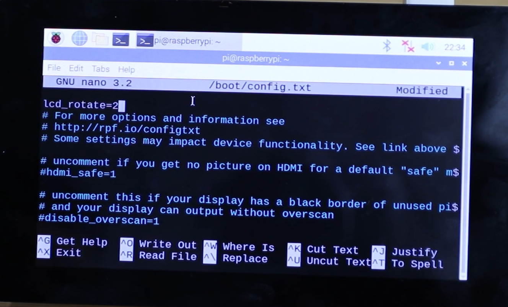

# 🦾 Exoskeleton UI
# Raspberry Pi Touchscreen Interface
This project is a graphical menu system built with Python and Kivy, designed to run on a Raspberry Pi 4 with the official 7" touchscreen.

This project is designed for real-time mode switching, configuration, and intuitive control of the exoskeleton.

## Features
- Full-screen 800x400px graphical interface with physical buttons

- Visual feedback of physical operations

- Buzzer-based feedback

- Clean software-hardware integration

## Hardware
| Component            | Details                          |
| ---------------------|----------------------------------|
| Raspberry Pi         | 4 Model B (2GB RAM)              |
| Touchscreen          | Official Raspberry 7" screen     |
| External buttons     | GPIO-connected buttons           |
| Audio                | GPIO passive buzzer              |
| Power Supply         | Official Raspberry supply        |
| microSD Card         | 32GB minimum, A1 or A2           |
-----------------------------------------------------------

## Installation instructions

#### Needed hardware
- Raspberry Pi 4 Model B
- Official Raspberry 7" screen
- A computer (Windows, macOS or Linux)
- Raspberry Pi Frame
- MicroSD Card (32GB minimum)
- MicroSD card reader
- 4 (already included in the Touchscreen) jumper cables Socket to Socket
- Ribbon cable DSI 
- Official Raspberry Power Supply (5V 3A)
- Screwdriver
- Antistatic Towel
- Keyboard with USB
- Mouse with USB

### 1. Raspberry Preparation

#### Initial physical connection  

- Place your anti-static towel on your work surface, and lay the touchscreen face down on it.
- Insert the four power cables and the DSI ribbon cable (blue side facing down). Make sure you hear a click when closing the DSI connector. It should look like the photo below:


This is the color coding:
*black* for GND
*yellow* for SCL
*green* for SDA
*red* for 5V


- Place the Raspberry Pi over the screw holes on the screen. Make sure they are properly aligned.


- Use the screws included in your touchscreen package and secure the Raspberry Pi in place using the Phillips screwdriver. Then, connect the cables from the screen to the Raspberry Pi in the correct order, and the DSI ribbon cable (again, blue side down). Make sure you follow the proper order.


Here is the correct order to connect the cables:
**MAKE SURE TO USE THE GUIDE IN** `assets/images/raspberrypinout.jpg` — this refers to the **PHYSICAL pins**, NOT the BCM numbering.

* *Black* → Physical pin 6 (**GND**)
* *Yellow* → Physical pin 5 (**GPIO/SCL1**) **I2C**
* *Green* → Physical pin 3 (**GPIO/SDA1**) **I2C**
* *Red* → Physical pin 4 (**5V**)


### 2. Flash and Configure the SD card

- On your computer, go to [this link](https://www.raspberrypi.com/software/) for the latest stable version of Raspberry Pi OS
- Download the correct version for your operating system
- Insert your microSD card into your computer. Back up your data — everything on the card will be **erased**
- In Raspberry Pi Imager, click **Choose OS**, then select **Raspberry Pi OS (32-Bit)**
- Click **Choose Storage** and select your microSD card
- *Optionally*, click **Settings** to configure the hostname, enable SSH, and other settings
- Click **Write** and wait for the program to download the system and install it on your microSD card. This should take around 10 minutes on average
- Once the installation is complete, insert the card into your Raspberry Pi
- Once these steps are complete, place everything into your frame. Be careful when handling the cables and the DSI ribbon. Use the screwdriver to close it up

**NOTE:** A common issue is that the screen appears upside down. If this happens to you, you’ll need to complete these additional steps when powering on the device:

* Open the terminal and run the command:

```bash
sudo nano /boot/config.txt
```

A text file will open — at the very top, add the line:

```bash
lcd_rotate=2
```


How the code should look like

After adding the line `lcd_rotate=2` in the terminal using `nano`, follow these steps to save and exit:

1. Press `Ctrl + O` (that's the letter **O**, not zero) to **write (save) the file**.
2. Press `Enter` to confirm the filename (`/boot/config.txt`).
3. Press `Ctrl + X` to **exit** the `nano` editor.
4. Back in the terminal, type:

   ```bash
   sudo reboot
   ```
   to restart the Raspberry Pi and apply the change.


### 3. Enable Interfaces
Con tu raspberry encendido, ve a la terminal en AÑADIR UBICACIÓN DE LA TERMINAL, y corre los comandos
```bash
sudo raspi-config
```
- Usa las flechas del teclado para navegar
- Ve a **Interface Options**
- ??? Activa SSH <-VER SI ES NECESARIO
- Activa I2C
- Regresa a **Advanced Options**, y después selecciona **Expand Filesystem**

### 4. Install the UI on the raspberry
- Go to [this page](https://github.com/TrashBandit9811/Exoskeleton-UI)
- Click on the blue botton named "Code"
- Select **Download ZIP**
- In your file explorer, look for the file and right-click it, then click "Extract files"
- Insert your USB and copy the contents of the extracted file inside
- Eject the USB safely
- Insert the USB in a Raspberry port
- On your Raspberry Pi, open the File Manager
- Find and open the USB drive
- Copy the entire folder of the extracted project
- Paste it inside your home folder (or any directory you prefer, e.g., /home/pi/Exoskeleton-UI)

### 5. Install Dependencies
- ???
- ???

### 6. Make App Run Automatically
- ???
- ???

## Other important files
For additional documentation, refer to:
- **wiring.md**: GPIO pinout and button/buzzer connections
- **ui-layout.md**
- **setup.md**


## Notes
This project is actively under development
