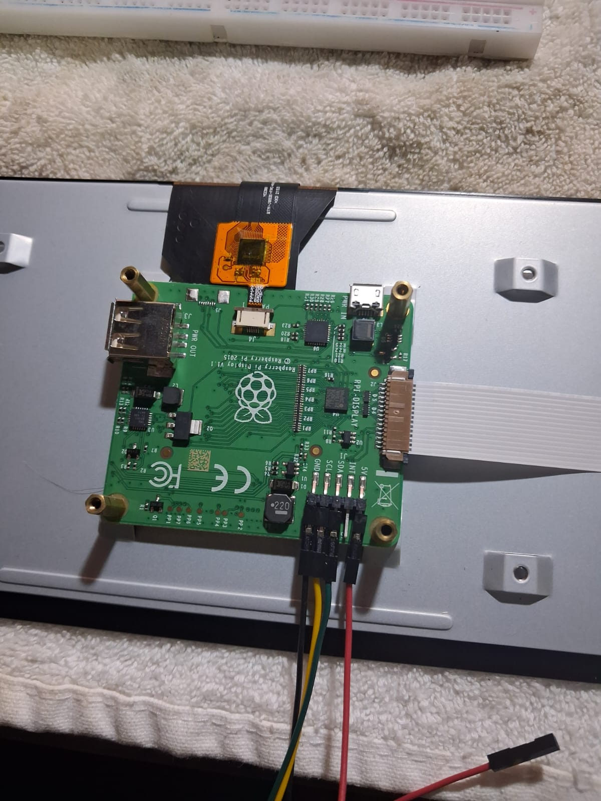
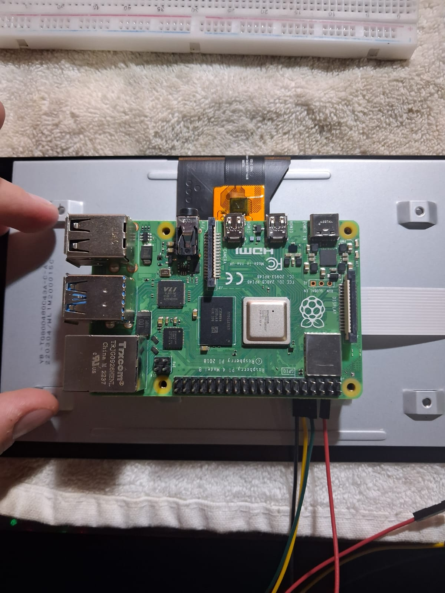
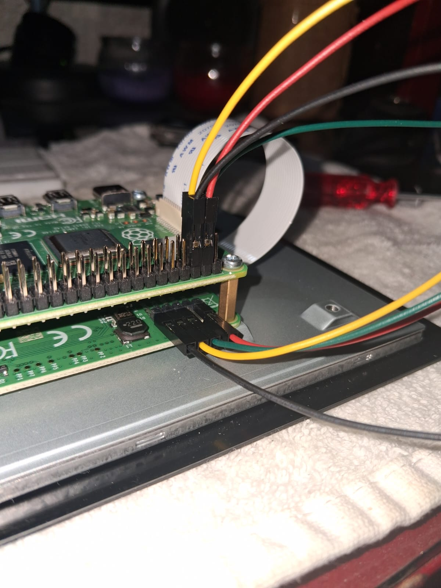

# 🦾 Exoskeleton UI
# Raspberry Pi Touchscreen Interface

This project is a graphical menu system created with **Python** and **Kivy** and designed to run on a **Raspberry Pi 4**, with a 7" touchscreen.

This project is designed for real-time mode switching, configuration and intuitive control

## Features

- Full-screen 800x480 UI with touch and physical buttons
- Operational mode for visual feedback
- Buzzer-based feedback system
- Clean hardware-software integration

## Hardware
| Component            | Details                          |
| ---------------------|----------------------------------|
| Raspberry Pi         | 4 Model B (2GB RAM)              |
| Touchscreen display  | 7" Official Raspberry Pi Display |
| External Buttons     | GPIO-connected tactile switches  |
| Audio Feedback       | Passive buzzer on GPIO           |
| Power Supply         | ???                              |
| Micro SD card        | 32GB minumum, A1 or A2           |
-----------------------------------------------------------

## Setup Instructions

#### Needed Hardware
- Raspberry Pi 4 Model B
- Official 7" Raspberry Pi Touschreen display
- A computer (Windows, macOS or Linux)
- Raspberry Pi Touchscreen Frame
- Micro SD card (32GB minumum)
- Micro SD card reader
- 4 jumper cables (female to female)
- DSI ribbon cable 
- Official power supply highly recommended (5V 3A)
- Screwdriver
- Antistatic towel

### 1.  Setup Raspberry Pi

#### Physical Initial Connection
You can follow the steps in [this video](https://www.youtube.com/watch?v=SIUfAIiSzJA&ab_channel=MakeUseOf)
- Place your towel on your working table, then the touchscreen display facing down
- Insert the four power wires, and the DSI ribbon cable (blue side down). Ensure it is securely locked with the catch. It should look as it is shown in the following image:  

The following colors are used:  
*black* for GND  
*yellow* for SCL  
*green* for SDA  
*red* for 5V  

- Mount the raspberry on top of the touchscreen, make sure the screw holes are correcly aligned.  


- Use the screwdriver and the screws included in the box to secure the Raspberry Pi. Next, connect the jumper cables to the Raspberry in the correct order, and the DSI ribbon cable (again, blue side down), make sure it was securely locked in place.  

This is the correct order to connect to the physical pins:  
BE CAREFUL TO USE PHYSICAL PINS AND NOT BCM
*black* to physical pin 6 (GND)  
*yellow* to physical pin 5 (GPIO/SCL1) **I2C**  
*green* to phisical pin 3 (GPIO/SDA1) **I2C**  
*red* to physical pin 4 (5V)  

### 2. Flash & Configure SD Card
- In your computer, go to [this link](https://www.raspberrypi.com/software/) for the latest Raspberry Pi Imager
- Download the version for your operating system
- Insert your Micro SD card into your computer. Backup any data, the whole card will be **erased**
- In Raspberry Pi Imager, click **Choose OS**, then select **Raspberry Pi OS (32-Bit)**
- Click **Choose Storage** and select your Micro SD card.
- *Optionally* click **Settings** to set hostname, enable SSH, and other configurations.
- Click **Write** and wait for the program to download, flash and verify the image.
- Once flashing is complete, eject your card properly and insert it into your Raspberry Pi's Micro SD slot  

- Once these steps are completed, mount your Raspberry touchscreen and Raspberry Pi to your frame. Be careful not to damage the jumper cables or the DSI ribbon. Use a screwdriver to hold it in place

NOTE: if your Raspberry Pi screen is upside down, you will need to complete the following steps
- Go to the terminal and run
```bash
sudo nano /boot/config.txt
```
At the top of the file, add the following text:
```bash
lcd_rotate=2
```

### 3. Enable Interfaces
```bash
sudo raspi-config
```
- Use your arrow keys to navigate
- Go to **Interface Options**
- ??? Enable SSH
- Enable I2C
- Go back and go to **Advanced Options**, then select **Expand Filesystem**


### 4. Install Dependencies
- ???
- ???

### 5. Make App Run Automatically
- ???
- ???

## Other important files
For additional documentation, refer to:
- **wiring.md**: GPIO pinout and button/buzzer connections
- **ui-layout.md**
- **setup.md**


## Notes
This project is actively under development
